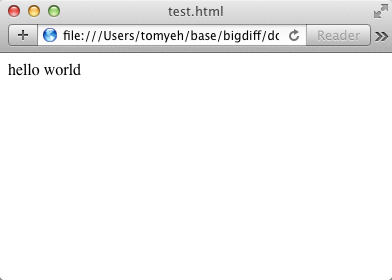
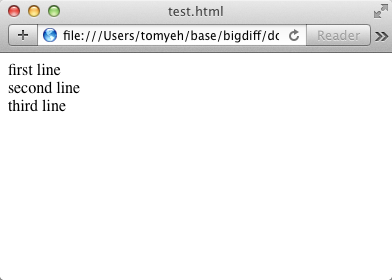
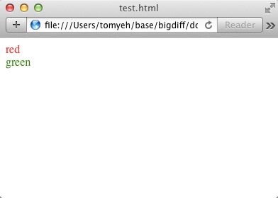

# domout

[](https://travis-ci.org/sikuli/domout)

A console.log() that renders in your browser.

The console is great - dynamic, powerful, and easy to use. However, when
developing for the web it can be difficult to figure out if your beautifully
created web-ready objects will render properly, or just show your user a jumble
of technical text. Domout to the rescue! Instantly send data to the and show
it how you want in the browser.

## Why

- Treat your browser like a console!
- Render data on the fly.
- Debug specific elements on page.

## Install

```sh
npm install [-g] domout
```

## Usage

Log "hello world" to a web page shown live in a browser.

```javascript
var domout = require('domout');
domout.log('hello world');
```

---

Log multiple lines in the append mode (default)

```javascript
var domout = require('domout');
domout.log('first line');
domout.log('second line');
domout.log('third line');
```

---

Use colors via Chalk

```javascript
var domout = require('domout'),
     chalk = require('chalk');

domout.log(chalk.red('red'));
domout.log(chalk.green('green'));
```

---

Redirect `console` to `domout`

```javascript
var domout = require('domout');
console = domout.console(console);

// all existing console.log now go to the browser
console.log('hello world');
```
---

Get some snoop in your system.

```javascript
var domout = require('domout');

domout.snoop('Sippin\' on gin n\' juice.');
```

## Creating a template

Anything in the `templates/` directory will be exposed by domout as a module.
In order to make a template, all you need to do is create a folder with a
`template.js` file and an `index.html` file.

1. Create a folder in templates with the desired name of your new template.
  - `mkdir template/MY_NEW_TEMPLATE`

1. Create a `template.js` file. In this file, define functions for piping data
to your template by using the `rawStream(...)` function.

1. Create an index.html which connects  on a socket to `localhost:7777`. This
will allow the template to receive data from domout. From there, you can do
whatever you need for displaying the data. An example of connecting to socket:

  ```javascript
  var socket = io.connect("http://localhost:7777");
  socket.on('domout', function (data) {
  // ... do fun things
  });
  ```

Note: Check out the `templates` folder for some _interesting_ examples.
